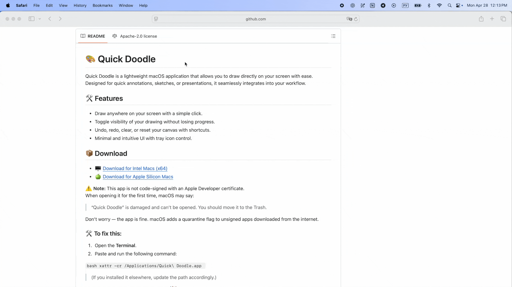

# 🎨 Quick Doodle
_A lightweight macOS annotation tool_

📽 **Preview**  

  

---

Quick Doodle is a lightweight macOS application that allows you to draw directly on your screen with ease. Designed for quick annotations, sketches, or presentations, it seamlessly integrates into your workflow.

## 🛠 Features
- Draw anywhere on your screen with a simple click.
- Toggle visibility of your drawing without losing progress.
- Undo, redo, clear, or reset your canvas with shortcuts.
- Minimal and intuitive UI with tray icon control.

## 📦 Download
- 🖥 [Download for Intel Macs (x64)](https://github.com/maksim-burakou/quick-doodle/releases/download/app-v0.1.0/Quick.Doodle_0.1.0_x64.dmg)
- 🍏 [Download for Apple Silicon Macs](https://github.com/maksim-burakou/quick-doodle/releases/download/app-v0.1.0/Quick.Doodle_0.1.0_aarch64.dmg)

⚠️ **Note:** This app is not code-signed with an Apple Developer certificate.  
When opening it for the first time, macOS may say:

> “Quick Doodle” is damaged and can’t be opened. You should move it to the Trash.

Don’t worry — the app is fine. macOS adds a quarantine flag to unsigned apps downloaded from the internet.

### 🛠️ To fix this:

1. Open the **Terminal**.
2. Paste and run the following command:

``bash
xattr -cr /Applications/Quick\ Doodle.app
``
>(If you installed it elsewhere, update the path accordingly.)

Now it should open without any issues! 🎉

## 🚀 How It Works
### Tray Icon Controls
- **Right-click** on the tray icon to open the app menu.
- Click **again** to close it.
- **Left-click** on the tray icon to start drawing. The icon will turn **green** to indicate drawing mode is active.
- Click **again** to stop drawing.

## 🎹 Keyboard Shortcuts

> 💡 On macOS, use `⌘` (Command) instead of `Ctrl`.

### 🌍 Global Shortcuts
| Shortcut | Action |
|----------|--------|
| `Ctrl + Shift + D` | **Create New Canvas** (always fresh) |
| `Ctrl + Shift + S` | **Show/Hide Canvas** (toggle previous one) |

### 🖌 Application Shortcuts
| Shortcut | Action |
|----------|--------|
| `Ctrl + Z` | **Undo** (reverts last drawn element) |
| `Ctrl + Shift + Z` | **Redo** (restores last undone action) |
| `Ctrl + C` | **Clear Canvas** (can be undone) |
| `Ctrl + R` | **Reset Canvas** (cannot be undone) |
| `Ctrl + Q` | **Toggle Toolbar** |
| `Ctrl + A` | **Toggle Background** |
| `[` / `]` | **Cycle through available thickness or font size** |
| `Shift + [` / `Shift + ]` | **Cycle through available colors** |

### ⚙ Other
| Shortcut | Action |
|----------|--------|
| `Ctrl + Q` | **Quit App** |